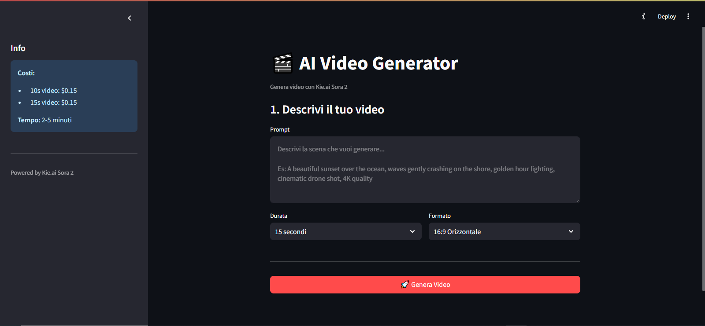
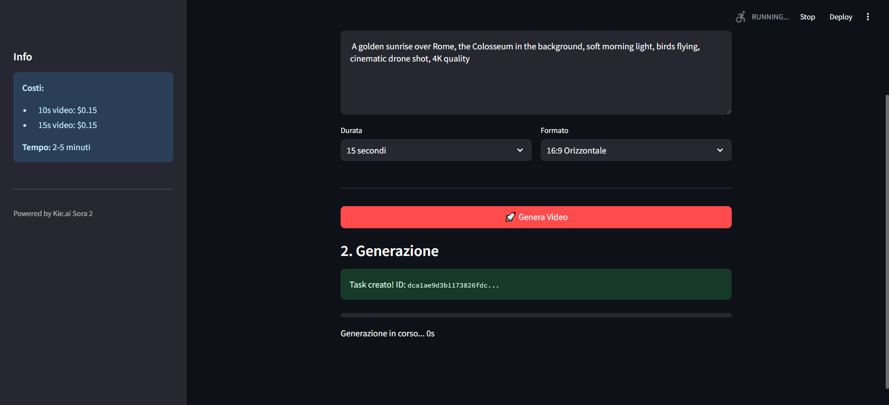

# AI Video Generator

Generate AI videos for just **$0.15 per clip** using Kie.ai Sora 2 API.






## Features

- **Web UI** - Simple Streamlit dashboard for video generation
- **Text-to-Video** - Generate videos from text prompts
- **Image-to-Video** - Animate images into video clips
- **Storyboard Pipeline** - Auto-generate multi-scene videos with Claude AI
- **Low Cost** - $0.15 per 10-15s video (vs $20+ for OpenAI Sora)

## Quick Start

### 1. Install

```bash
pip install -r requirements.txt
```

### 2. Configure

```bash
cp .env.example .env
```

Edit `.env`:
```
KIE_API_KEY=your-kie-key
OPENROUTER_API_KEY=sk-or-v1-xxx  # Optional, for storyboard generation
```

Get API keys:
- **Kie.ai**: https://kie.ai (Sora 2 API)
- **OpenRouter**: https://openrouter.ai/keys (for storyboard AI)

### 3. Run Web UI

```bash
streamlit run app.py
```

Open http://localhost:8501 and start generating videos!

### CLI Alternative

```bash
python video_generator.py  # Full storyboard + video pipeline
```

## Scripts

| Script | Description |
|--------|-------------|
| `app.py` | **Web UI** - Streamlit dashboard |
| `video_generator.py` | Full workflow: storyboard + video |
| `genera_loop_video.py` | Single 15s video with auto-download |
| `genera_da_storyboard.py` | Generate from existing storyboard |
| `download_videos.py` | Download videos from URLs |
| `merge_videos.py` | Merge clips with FFmpeg |

## Kie.ai Models

| Model | Description |
|-------|-------------|
| `sora-2-text-to-video` | Text prompt to 10s/15s video |
| `sora-2-image-to-video` | Animate an image |
| `sora-2-pro-text-to-video` | Pro quality (720p/1080p) |
| `sora-2-pro-image-to-video` | Pro image animation |
| `sora-watermark-remover` | Remove watermarks |

## Pricing

| Service | Cost |
|---------|------|
| Sora 2 (10s/15s) | $0.15 (30 credits) |
| Sora 2 Pro Standard | $0.75-$1.35 |
| Sora 2 Pro HD | $1.65-$3.15 |
| OpenRouter (Claude) | ~$0.01-0.05 per storyboard |

## Output

Generated videos are saved to the `output/` directory:
- `scene_01.mp4`, `scene_02.mp4`, ... - Individual clips
- `storyboard_*.json` - Generated storyboard

## Requirements

- Python 3.10+
- FFmpeg (for video merging)
- Kie.ai API key

## License

MIT
